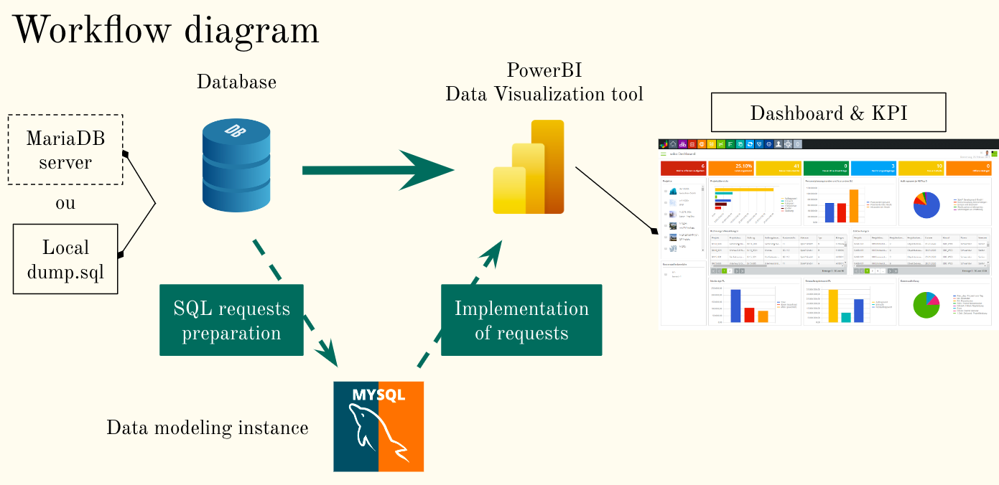

# :car:  Model-Company-Dashboarding 
*Student Project with SQL and PowerBI*

## :beginner: Subject 

We were commissioned by a fake company selling models and scale models. 
The company already has a database that lists employees, products, orders, and much more. 
The director of the company wishes to have a dashboard which he could refresh each morning to have the latest information in order to manage the company.

## :dart: Product Backlogs

The dashboard revolves around these 4 main topics : 
- **Sales** : Number of products sold by category and by month, compared to the sales of the previous year.
- **Finance** : Turnover of the orders of the last two months by country and orders that have not been payed yet.
- **Logistics** : Stocks of the products that need to be supplied, calculated in function of the sales predictions for the next 3 months, and stock value.
- **Human Resources** : Each month, the two sellers with the higher turnover, and the evolution of the sales of each seller. 

## :wrench: Tools

## :handshake: Team

<a href="https://github.com/racettour" target="_blank" rel="noopener noreferrer">
<a href="https://github.com/AlPava" target="_blank" rel="noopener noreferrer">
<a href="https://github.com/MarionFourrier" target="_blank" rel="noopener noreferrer">
<a href="https://github.com/VarlamV" target="_blank" rel="noopener noreferrer">
<a href="https://github.com/boussalemmo" target="_blank" rel="noopener noreferrer">
